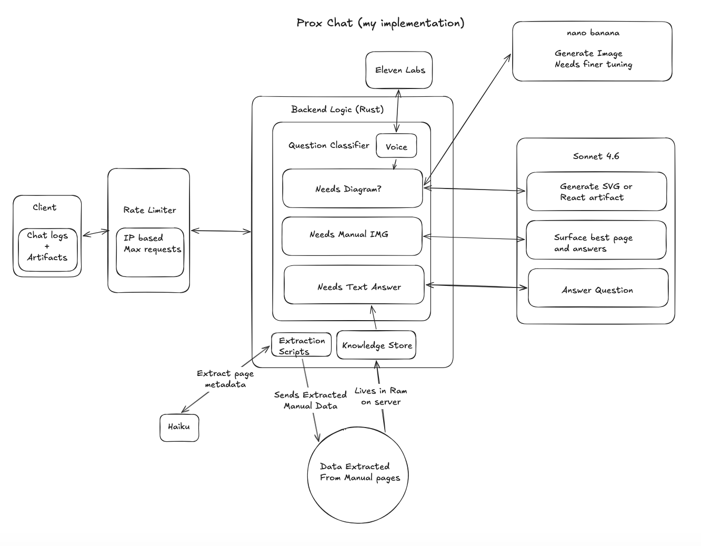
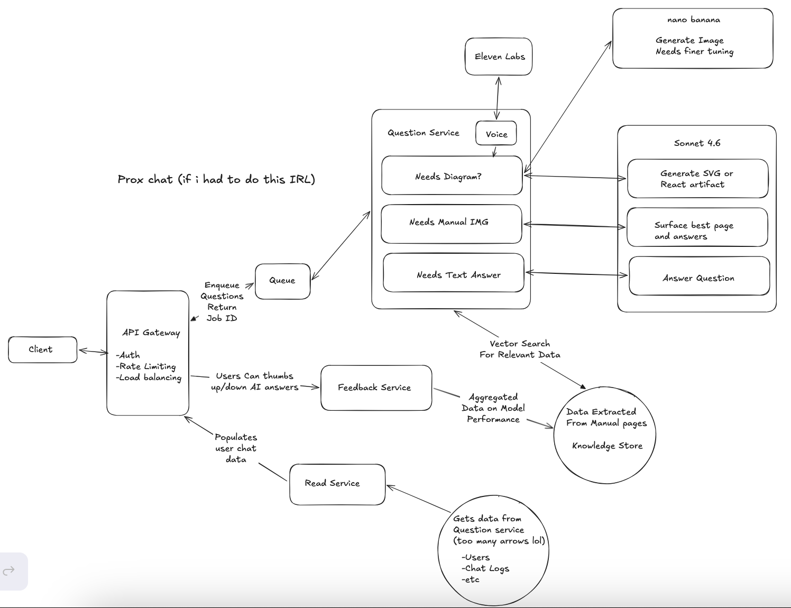

# Vulcan OmniPro 220 AI Assistant

A multimodal reasoning agent for the Vulcan OmniPro 220 welder. Ask it anything about setup, polarity, duty cycles, or troubleshooting and it responds with the right medium: interactive calculators, annotated manual pages, SVG diagrams, or plain text depending on what the question actually needs.

---

## Features

- **Multimodal responses** - Claude picks the right format for each question: interactive React components, SVG diagrams, annotated manual pages, or plain text
- **Voice mode** - tap to speak, ElevenLabs reads the answer back
- **Image upload** - take a photo of your machine and ask what's wrong with it
- **Annotated manual pages** - Claude can surface the exact page and point at the exact thing it's referring to
- **Interactive artifacts** - duty cycle calculators, troubleshooting flowcharts, settings configurators all generated on the fly
- **Rate limiting** - IP-based sliding window plus a concurrency cap so the demo doesn't get hammered

---

## Setup (know this is a bit long but chose tooling and build steps for the best outcomes instead of speed)

Prerequisites: Rust (stable), Node.js 18+, an Anthropic API key. fal.ai and ElevenLabs keys are optional (image generation and voice TTS are disabled if missing).

```bash
git clone <repo>
cd prox-challenge
cp .env.example .env
# fill in ANTHROPIC_API_KEY (required), FAL_KEY and ELEVEN_KEY (optional)
```

Process the manual once before running (takes 2-3 min):

```bash
pip install pymupdf anthropic python-dotenv tqdm
python3 scripts/process_pdfs.py
python3 scripts/extract_knowledge.py
```

Then start the app:

```bash
cd backend && cargo run        # http://localhost:3001
cd frontend && npm install && npm run dev  # http://localhost:5173
```

---

## Methodology

I treated this as a V1 and time boxed it for ~6 hours. I built it as if i had to demo to a potential customer the next morning. Got everything i needed cut the fat that could be added after that call

These didnt make the cut. auth, database, message queue. Chat history lives in the browser. The knowledge store lives in server RAM. Each of those has a clear production answer but none of them change how the demo feels.

The core pipeline: the manual and the transcript from the video (wanted to add this because the guy had some cool tips and tricks) are processed offline using Haiku to extract structured facts/tips from every page (duty cycles, polarity setups, troubleshooting entries, page summaries). At runtime Sonnet gets the structured facts plus the top 3 most relevant manual page images injected as actual vision content on every request.

**My implementation**



**If I had to build this for real if i had more time and at scale**



Key differences: the monolith splits into dedicated services, a queue sits in front of the question service so burst traffic doesn't take the whole thing down, the in-memory knowledge store becomes a real vector DB with semantic search because large quantities of data in ram are hard to scale, chat history moves server-side and persists across sessions, and there's a feedback loop where thumbs up/down on answers actually improves retrieval over time (if we kept this in ram as well it would cook us later on as we scale).

---

## Technical Decisions

**Haiku for extraction, Sonnet for chat.** Extraction is a batch job that runs once. Cost matters, quality matters less. Sonnet handles all live chat where we dont wanna annoy users.

**Keyword scoring over vector embeddings.** 51 pages, narrow and consistent vocabulary. Keyword matching over page metadata is fast, deterministic, and accurate enough. A production system with multiple manuals or a larger corpus would use pgvector.

**SVG over AI image generation for diagrams.** I tried using 10 - 15 image gen models and landed on nano-banana-pro with the real Harbor Freight product photos as image-to-image references. For photorealistic machine views it worked reasonably well. For labeled technical diagrams it doesn't work at all: text renders unreliably, positions are approximate, and the result doesn't actually help someone trying to wire a cable. Claude drawing SVG as code is the best answer ive found personally. Ive gotten nano banana's image gen to about ~80% of where i want it but thats kinda low tbh so it remains only for niche use cases. The image generation path is still in for when someone explicitly asks to see the physical machine.

**Rust backend.** Clippy and the type system. When you're moving fast with LLMs, having the compiler and linter catch everything means code that compiles is almost always correct. You can go way faster and the result is more stable than Python or Node where things fail quietly at runtime.
